# Stage 3: Database Implementation and Indexing 

## Database Implementation

We created a MySQL database instance on GCP based on the instructions from class, connected to it via GCP console and MySQL workbench, and ran the DDL commands. We then uploaded the data from our Kaggle dataset to the MySQL database, inserting at least 1000 rows for five of the tables.

### Implementing the database tables on GCP for extra credit

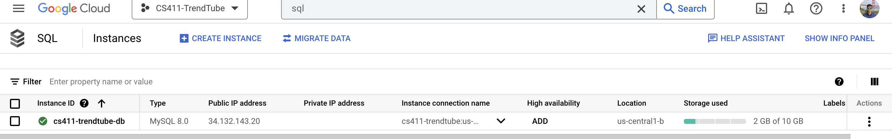

**Created the database on GCP**

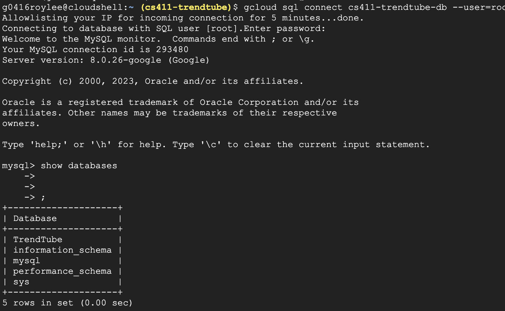

**Connected to the database on GCP**

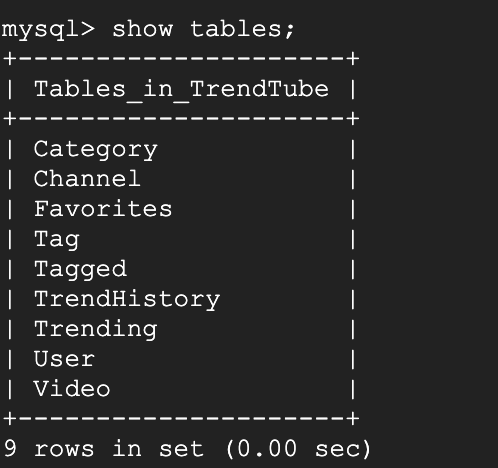

**Showing the tables on GCP**

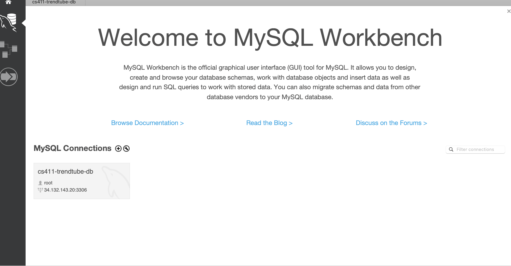

**Connected to the database on MySQL workbench**

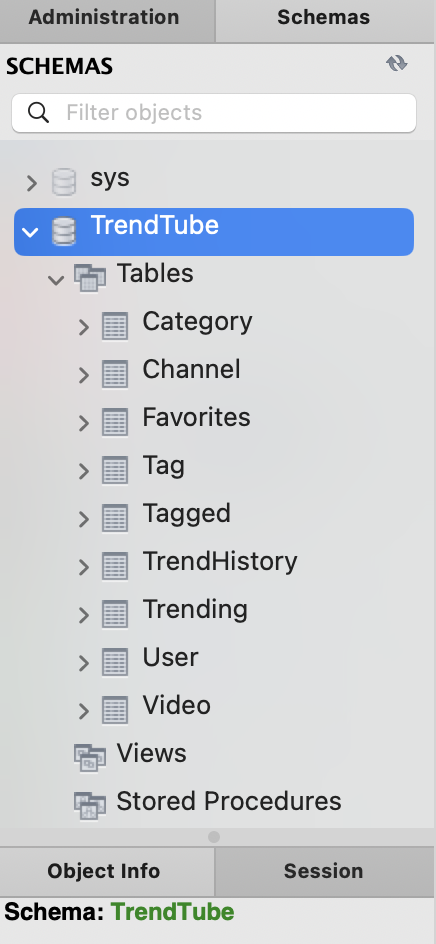


**Showing the tables on GCP**

### DDL commands

```sql

CREATE TABLE User(
  username CHAR(255), 
  firstName CHAR(30), 
  lastName CHAR(30), 
  passwordHash CHAR(255),
  passwordSalt CHAR(255), 
  email CHAR(255),
  PRIMARY KEY(username)
);

CREATE TABLE Channel(
  id CHAR(255),
  channelTitle CHAR(255),
  PRIMARY KEY(id)
);

CREATE TABLE Tag(
  id INTEGER, 
  title CHAR(255),
  PRIMARY KEY(id)
);

CREATE TABLE Category(
  id INTEGER, 
  categoryTitle CHAR(30),
  PRIMARY KEY(id)
);


CREATE TABLE Video(
	id CHAR(255), 
	title CHAR(255), 
	publishedAt CHAR(255), 
	views INTEGER,
	likes INTEGER, 
	dislikes INTEGER,
	commentsDisabled BIT, 
	ratingsDisabled BIT, 
	description TEXT, 
	commentCount INTEGER, 
	thumbnailLink CHAR(255), 
    channelId CHAR(255) REFERENCES Channel(id)
    ON UPDATE CASCADE
    ON DELETE CASCADE,
    categoryId INT REFERENCES Category(id)
	ON UPDATE CASCADE
    ON DELETE SET NULL,
	PRIMARY KEY (id)
);


CREATE TABLE TrendHistory(
  id INTEGER, 
  country CHAR(30), 
  trendDate DATE,
  PRIMARY KEY(id)
);

CREATE TABLE Tagged(
	tagId INTEGER REFERENCES Tag(id)
    ON DELETE CASCADE
    ON UPDATE CASCADE, 
	videoId CHAR(255) REFERENCES Video(id)
	ON DELETE CASCADE
    ON UPDATE CASCADE,
	PRIMARY KEY(tagId,videoId)
);


CREATE TABLE Favorites(
	username CHAR(255) REFERENCES User(username)
    ON UPDATE CASCADE
    ON DELETE CASCADE, 
	channelId CHAR(255)REFERENCES Channel(id)
    ON UPDATE CASCADE
    ON DELETE CASCADE,
	PRIMARY KEY(username,channelId)
);


CREATE TABLE Trending(
	trendId INTEGER REFERENCES TrendHistory(id) 
    ON UPDATE CASCADE
    ON DELETE CASCADE, 
	videoId CHAR(255) REFERENCES Video(id)
	ON UPDATE CASCADE
    ON DELETE CASCADE,
	PRIMARY KEY(trendId,videoId)
);
```

### 1000 rows in at least 3 tables

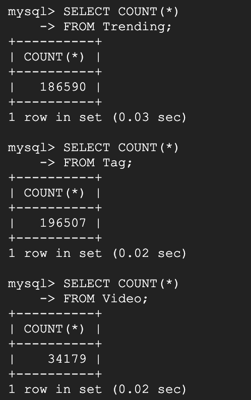


## Advanced Queries

This query fetches the channel title and average number of likes and comments for all of its videos that have a tag containing "music", more than 100000 views, and more than 100000 likes. It uses aggregation via GROUP BY and subquery.

```sql
SELECT c.channelTitle, AVG(v.likes) as avgLikes, AVG(v.commentCount) avgComments
FROM TrendTube.Video v JOIN TrendTube.Channel c ON (v.channelId=c.id)
WHERE v.title LIKE '%music%' and v.id IN (SELECT id 
       FROM TrendTube.Video
       WHERE views > 100000 and likes > 10000)
GROUP BY c.channelTitle
ORDER BY avgLikes, avgComments DESC;
```

These are the top 15 results:

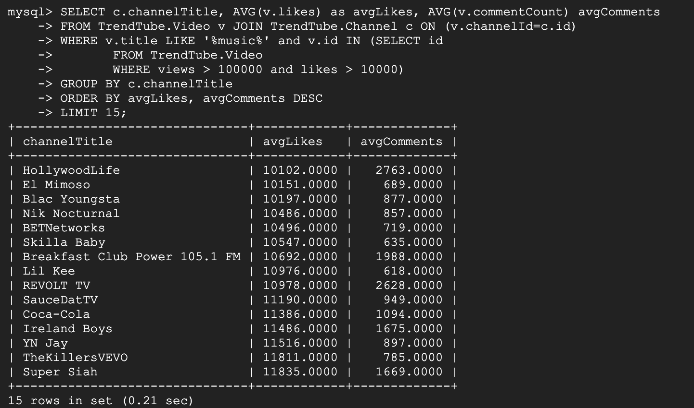

This query returns the id and title of all videos that contain "music" in at least one of their tags, description, and title unioned with all videos that contain "sport" in at least one of their tags, description, and title. It uses JOIN of multiple relations and set operations.

```sql
(SELECT v.id, v.title
FROM TrendTube.Video v JOIN TrendTube.Tagged td ON (td.videoId = v.id) JOIN TrendTube.Tag tg ON (td.tagId=tg.id)
WHERE tg.title LIKE '%music%' AND (v.description LIKE  '%music%'  AND v.title LIKE '%music%' ))
UNION
(SELECT v.id, v.title
FROM TrendTube.Video v JOIN TrendTube.Tagged td ON (td.videoId = v.id) JOIN TrendTube.Tag tg ON (td.tagId=tg.id)
WHERE tg.title LIKE '%sport%' AND (v.description LIKE  '%sport%'  AND v.title LIKE '%sport%' ));
```

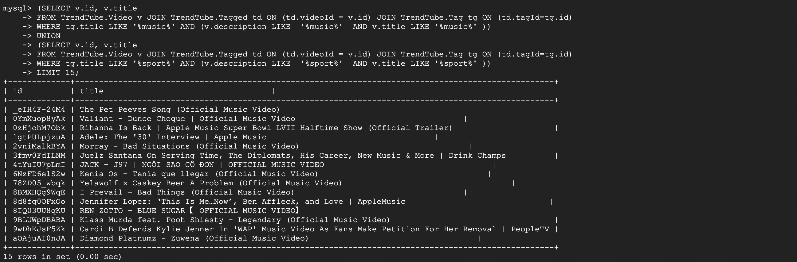

## First Query Indexing Analysis

We chose three different indexing designs that index a non-primary key in the Video entity. We chose `Video.views` and `Video.likes` because both are included in the subquery and chose `Video.title` because it is included in the WHERE statement of our query. We know from class that doing this can help improve the performance of our query because these are the specific attributes that are checked in the GROUP BY query. This reasoning is supported by our EXPLAIN ANALYZE results. 

For `Video.views`, the `Filter: ((Video.views > 10000...` step had actual time 0.073...17.169 while the non-indexed query had actual time 0.080...18.516. Hence, running the step on the first row and running the step on all of the rows was less for the query with the index. The Sort query also took 10ms less time since the time to perform it on the non-indexed version was 203.617 ms while it was 191.810 ms for the indexed version. Finally, the `Aggregate using temporary table` took 12ms less than the non-indexed version. The other steps in the indexed query had similar or the same time and cost as the non-indexed query. Hence, there was a slight performance increase with this index.

For `Video.likes`, the `Filter: ((Video.views > 10000...` step had actual time 0.073...17.817 while the non-indexed query had actual time 0.080...18.516. Hence, running the step on the first row and running the step on all of the rows was less for the query with the index. However, the Sort query took 1ms more time since the time to perform it on the non-indexed version was 203.617 ms while it was 204.859 ms for the indexed version for the all of the rows. The other steps in the indexed query had similar or the same time and cost as the non-indexed query. Hence, there was a slight performance increase with this index, but not as prominent as the `Video.views` index.

For `Video.title`, the `Filter: ((v.title like '%music%'...` had the same time as the non-indexed version, and the actual time to run the Sort query for all of the rows was 2 ms more than the non-indexed version. Hence, this indexing didn't have that much of an impact on the performance of the query. We think that since the word music can exist in any part of the video title, indexing the video title may not help much. We also think this is the case because title wasn't a part of the subquery and was only a part of the SELECT statement, which isn't an expensive computation.

No index
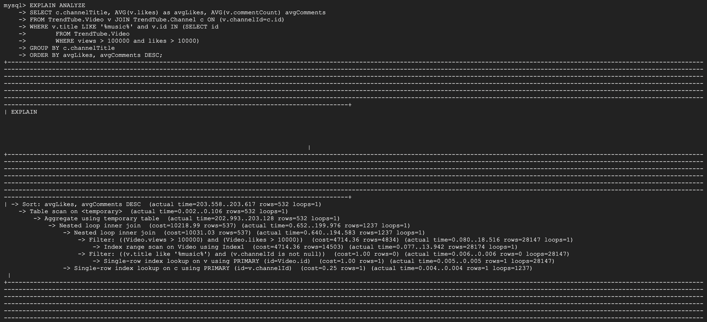

Index on Video.views
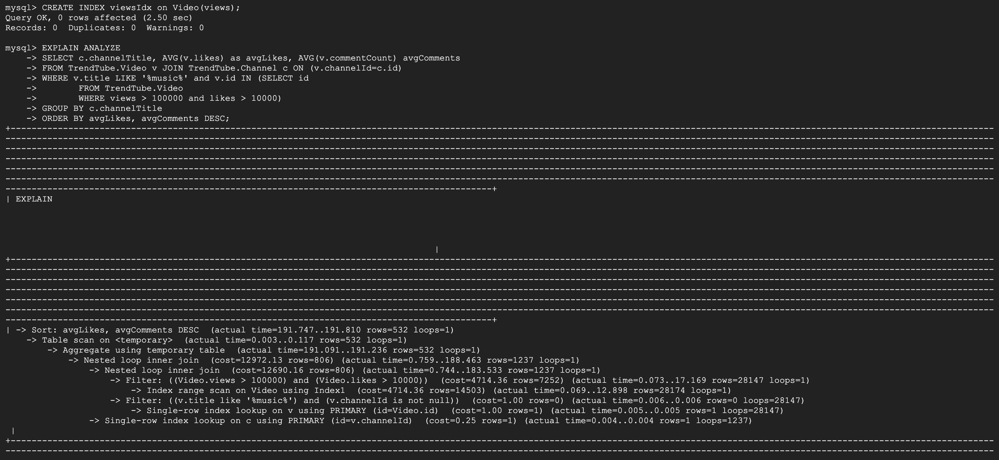

Index on Video.likes
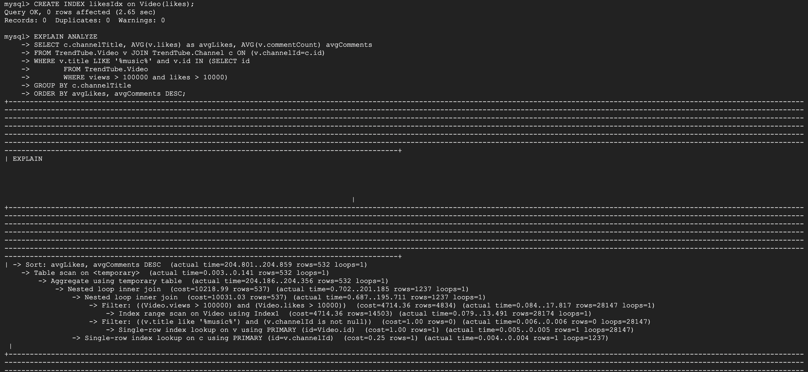

Index on Video.title


## Second Query Indexing Analysis

We chose these indexes because we're querying based on the tag title and description and returning video title in the results on the query. Specifically, `Tag.title` and `Video.description` are used with the LIKE statement and so we believe that including them as indexes can speed up the query. For these indexes, we found mixed results in improvement in query time and cost.

For `Tag.title`, the `Union materlization...` and `Nested loop inner join` took more than triple the time of the non-indexed version for the all of the rows. Moreover, there wasn't any considerable improvement in the `Filter: (tg.title...` step as both the non-indexed version and indexed version had roughly the same cost and time. All of the other steps had nearly the same cost and time. We believe that this index hurt our query performance this is because for textual columns indexes work by indxed N characters starting from the left. When we did LIKE "%music%" and "%sport%" we can't use the index because there can be any number of characters before the text.

In comparison, for `Video.description` we added an index for the left 20 characters of the video description. Based on the EXPLAIN ANALYZE results, this didn't have an impact on the performance but it also didn't hurt the query as badly as the `Tag.title` index. `Union materlization...` took 10ms more for this index compared to the non-indexed query, and the `Filter: ((v.description...` step took 0.001 ms less time. However, similar to the reasoning for `Tag.title`, we believe that the nature of how `Video.description` was used with LIKE prevented it from being a useful index.

Finally, for `Video.title`, the results were similar to `Video.description.` There was no considerable change in cost and time, and we believe this happened because title wasn't a part of any search or sort operation.
 
No index


Index on Tag.title
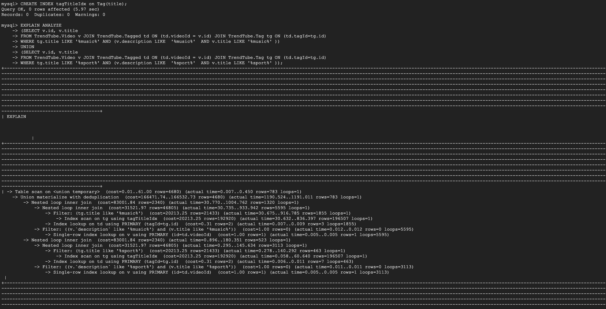

Index on Video.description
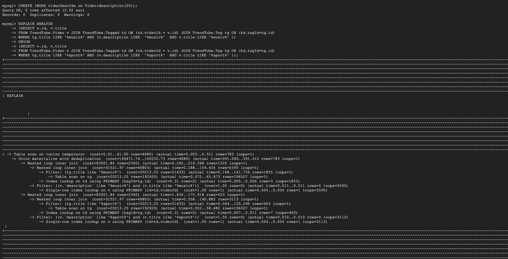

Index on Video.title
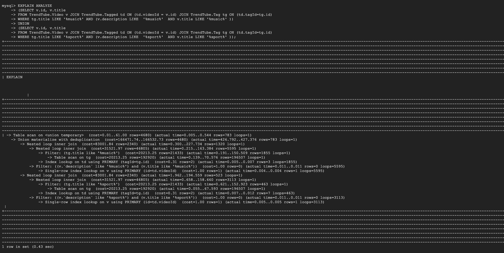

## Resolving Feedback from Stage 2

We updated our Stage 2 document with feedback.

- We removed other attributes from other entities from the Video entity.
- We removed the mismatch for Favorites, Tagged, and Trending.
- We fixed the Listed relationship.

The changes can be found here [Design.md](Design.md).
