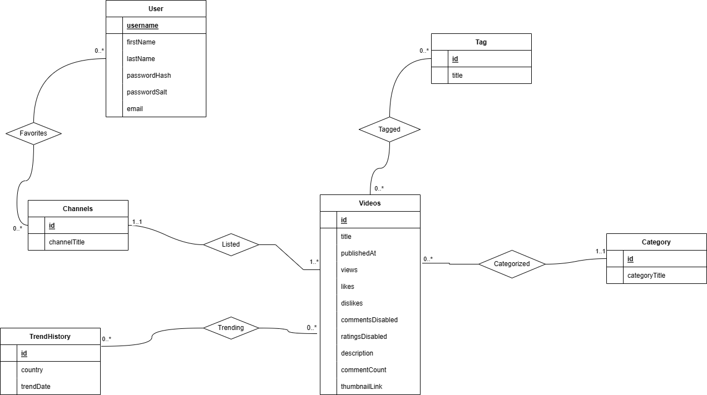

# Stage 2: Conceptual and Logical Database Design

## UML diagram



## Assumptions of the ER/UML diagram

We decided to create our Entities based on our [YouTube Kaggle dataset](https://www.kaggle.com/datasets/rsrishav/youtube-trending-video-dataset?select=US_youtube_trending_data.csv), and remove redundant records from the dataset by representing them as entities (ex: tags, categories, and trending dates). 

A description each each entity and what data it represents:

* **User**: Contains information regarding user login information. We will uniquely identify users by their username (username is Primary Key). Hence, when users sign up on our website, they cannot use a username that already exists.
* **Channels**: Contains list channel IDs, channel names of all channels that have been featured on trending. We will uniquely identify each channel by its channel ID.
* **Videos**: Contains information about youtube videos, where each video is uniquely identified by the video ID. Videos in this table do not have to be trending. This entity contains majority of the information found in our [Kaggle dataset](https://www.kaggle.com/datasets/rsrishav/youtube-trending-video-dataset?select=US_youtube_trending_data.csv).
* **TrendHistory**: Represents a past date during which videos were trending in some country (United States, Great Britain, Japan, Canada, Korea, Russia, etc). We will uniquely identify a trend by an integer trend id.
* **Tag**: Tags are words that are associated with YouTube videos, like "prank" or "skit" or "meme." We will uniquely identify a tag by an integer tag id.
* **Category**: YouTube categories are used to [identify the type of video](https://www.tutorialspoint.com/what-are-the-different-types-of-youtube-video-categories). Each category has a type, like "Animation", "Travel", or "Comedy". We will uniquely identify a category by an integer category id.

None of these entities depend on one or more different entities to uniquely identify themselves, and hence our diagram doesn't contain any weak entity sets.

A description of each relationship and its cardinality:
* **Favorites**: Stores list of channels that a user favorites. Each user can have 0 to many favorited channels and each channel can be favorited by 0 to many users. Hence, this is a **Many to Many** relationship.
* **Listed**: Represents all of the videos listed in a channel. Each channel can have one to many videos and each video must be associated exactly 1 channel. Hence, this is a **One to Many** relationship.
* **Trending**: Marks a video as trending some time in the past. Each YouTube video can be trending in 0 or more countries in a given time frame, and for all time frames and countries, there can be 0 or more trending videos. Hence, this is a **Many to Many** relationship.
* **Tagged**: Represents tagging a video. Each tag can be used for 0 or more videos, and videos can have 0 or more tags. Hence, this is a **Many to Many** relationship.
* **Categorized**: Represents categorizing a video. Different videos can have the same category, but videos must have exactly 1 category. Moreover, there can be categories that aren't associated with any videos. Hence, this is a **One to Many** relationship.

## Relational Schema

*Entity Sets:*

```
User(username:CHAR(255) [PK], firstName:CHAR(30), lastName:CHAR(30), passwordHash:CHAR(255), passwordSalt:CHAR(255), email:CHAR(255))

Channel(id: CHAR(255) [PK], channelTitle: CHAR(30))

Tag(id :INTEGER [PK], title: CHAR(255))

Category(id: INTEGER [PK], categoryTitle: CHAR(30))

Video(id: CHAR(255) [PK], title: CHAR(255), publishedAt: CHAR(255), views: INTEGER, likes: INTEGER, dislikes: INTEGER, commentsDisabled: BIT, ratingsDisabled: BIT, description: CHAR(255), commentCount: INTEGER, thumbnailLink: CHAR(255), categoryId: INTEGER [FK to Category.id], channelId: [FK to Channel.id] )

TrendHistory(id: INTEGER [PK], country: CHAR(30), trendDate: CHAR(255)
```

*Relations:*

```
Tagged(tagId: INTEGER [PK, FK to Tag.id], videoId: CHAR(255) [PK, FK to Video.id])

Favorites(username CHAR(255) [PK, FK to User.username], channelId: CHAR(255) [PK, FK to Channel.id])

Trending(trendId: INTEGER [PK, FK to TrendHistory.id], videoId: CHAR(255) [PK, FK to Video.id])
```

## Resolving Suggestions from Stage 1

We've fixed the project summary link in the [TeamInfo.md](https://github.com/cs411-alawini/sp23-cs411-team043-jams/blob/stage-2/TeamInfo.md) and emphasized that we'll focus on data visualizations instead of machine learning for the creative component. 
