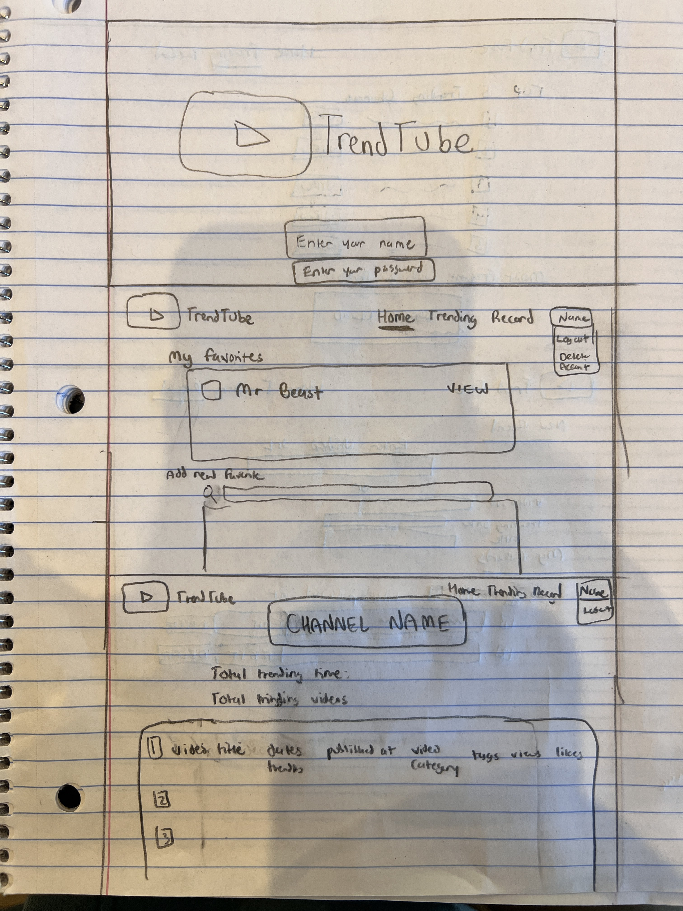
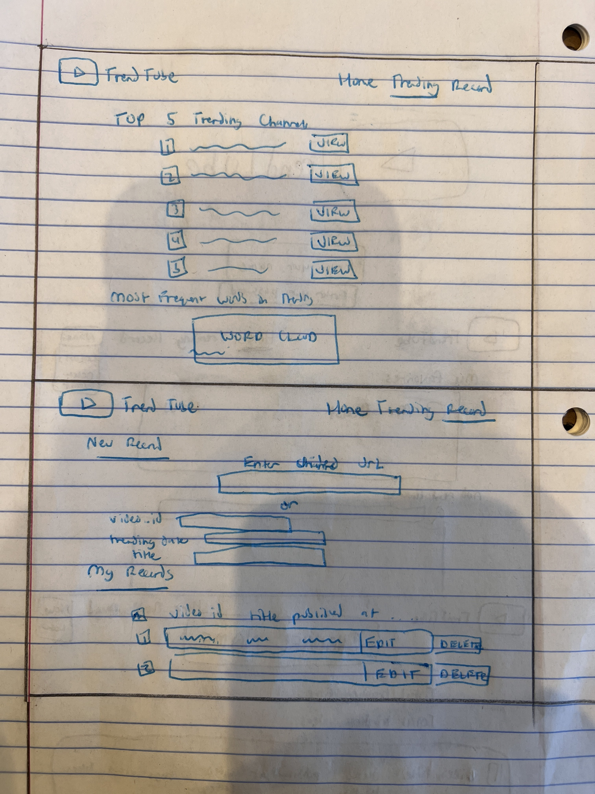

# Stage 1: Detailed Project Description

Project Title: TrendTube

# Project Summary/Application Description

This project will be a web application that will allow users to interact with YouTube's Trending Videos. YouTube is a global online video sharing website that has a [Trending Page](https://www.youtube.com/feed/trending). 
According to Variety magazine, “To determine the year’s top-trending videos, YouTube uses a combination of factors including measuring users interactions (number of views, shares, comments and likes)." Channels whose videos are displayed on the Trending Page are likely to be successful channels or gain a large number of subscriptions from being showcased on the Trending Page.

However, there are some problems with the presentation, transparency, and record-keeping of YouTube's trending videos:

- Trending Videos get updated everyday, so YouTube viewers have no record to past trending videos from their favorite channels.
- YouTube doesn't highlight similarities in trending video titles, thumbnails, and comment section. This information would be useful to channels that want to have trending videos.

Hence, our application will solve these problems with the following functionality:

- YouTube viewers can login in order to have a record of their channel subscriptions in our database.
- YouTube viewers can favorite channels in order to have direct access to the channel's trending videos.
- YouTube viewers can query and view subsets of trending video data from the database.
     - Ex: specific date ranges, specific channels, specific types of videos, videos with titles that contain specific keywords, videos with likes, etc..
- YouTube viewers can access links to past trending videos in order to watch the videos.
- Owners of YouTube channels can input and update their trending videos.
- Owners of YouTube channels can filter data by metrics and then view data visualizations that highlight similarities between trending videos.

Our project will rely on the [YouTube Trending Video Dataset found on Kaggle](https://www.kaggle.com/datasets/rsrishav/youtube-trending-video-dataset?select=US_youtube_trending_data.csv). 
This dataset is part of the TA elected datasets for extra credit. More details on this dataset are in the sections below.

# Application Usefulness

Socialblade is an example of a similar website to our team’s goal.  Similar to the website that the team is trying to build, Socialblade list outs popular channels from different video platforms e.g. Twitch, TikTok and let users log in to the website to manage their favorite videos. However, SocialBlade doesn't have detailed information on trending videos, including historical trending video data.

Our application will be useful because it will allow YouTube users to query historical trending video data and input new data on trendinb dideos. This will allow users to search trending videos based on various criteria and analyze their trend. Moreover, we plan to add some visualizations features as stretch goals to help users understand their personal preferences and the factors that make Youtube videos trending.

# Application Realness

Our data is available in a public dataset on Kaggle: https://www.kaggle.com/datasets/rsrishav/youtube-trending-video-dataset?select=US_youtube_trending_data.csv. 

- The dataset contains data from August 3, 2020 - Present and is updated daily. The data contains all videos on the trending section of YouTube for multiple different regions. Each row in the dataset contains attributes describing a video that was featured in the trending section of YouTube at some point. The project uses real data collected with the YouTube API. The attributes stored in each row are video id, title, channel title, channel id, publish date/time, trending date/time, category id, tags, view count, # of likes/dislikes, # of comments, link to picture of thumbnail, tracks if like/dislike is enabled/disabled, and description.

-Data visualization is an examples of a creative component we can implement to improve the functionality of our website. With data visualizations, we can do some statistical analysis on how trending videos have changed over time. Moreover, we could use some form of machine learning to make predictions about whether or not a video will be featured on trending, or natural language processing to analyze what factors affect video popularity and lead to videos being listed in the trending section.  We can also categorize videos to see what types of videos were most frequently present in the trending section.

# Application Functionality

Basic Functions:
Query video data from the database

Simple Features:
- View data regarding the trending videos.
- Users can query subsets of the dataset and view specific data from the database in tabular form Ex: specific date ranges, specific channels, specific types of videos, videos with titles that contain specific keywords, videos with likes / dislikes > #, trending videos from specific countries/region, etc..
- Users can mark some channels as their favorites and save them into database
- Users can query video data only from the selected favorite channels.

Complex Features:
     - Users can filter data by some metric (similar to above) and then the website will create some form of graph visualization of the data.

- Interactive Data visualizations
     - Pie-Chart of trending video by genre
     - Number of trending videos for each channel in line graph
     - Histogram for common words in the title and tags of trending videos

If we have time, we will implement a machine learning feature:
     - When a new video data is given, estimate the probability of this video will go trending in Youtube.
     - When user searches a video estimate the probability that the video is liked by the user.
     
However, we will primarily focus on the data visualization aspect for the compelx features.

## Low-Fidelity UI Mockup

  

- The top page is our landing page. It will contain the user login.
- The middle page is the dashboard for the logged in user. It will contain a section for viewing a user's favorited channels, adding new favorited channels (users can be recommended which channels to add with machine learning), and clicking to view more details on a channel. The top of the screen will contain a navigation bar that features log-out and delete account buttons.
- The bottom page is the feature page for a channel. It contains trending statistics that will be determined by complex SQL aggregations, a section for all of the trending videos related to that channel, and links to view each of the trending videos.

  

- The top page is the trending page for all YouTube channels. It will display the top 10 YouTube channels based on most trending videos, along with data visualizations (word cloud, histogram) indicating common words that show up in the titles and tags of trending videos.
- The middle page is the page for recording a new trending video. Users can paste in a YouTube video url or manually enter each field that is stored in the database for a trending video. Users can also update past trending videos that they've recorded or delete them in the event that the video is outdated or no longer available.

## Tech Stack

Our frontend tech stack will be Next.js, React, TypeScript, and Tailwind CSS.
Our backend tech stack will Node.js, Express, TypeScript, and MySQL.
Both the frontend and backend will be formatted with Prettier.

We will also deploy the backend to Google Cloud Platform and host the frontend on GitHub Pages.

## Project Work Distribution

Our work will be split up into frontend and backend work. Jin Ho Lee and Soham Kulkarni will work on the frontend. Ashay Parikh and Matthew Bosch will work on the backend.

The frontend work responsibilities will be:

- Designing and implementing the UI components for our website.
- Handling the page routing for our web application.
- Managing frontend state related to Trending YouTube videos.
- Handling logic for API calls.

The backend work responsibilities will be:
- Parsing the [YouTube Trending Video Dataset found on Kaggle](https://www.kaggle.com/datasets/rsrishav/youtube-trending-video-dataset?select=US_youtube_trending_data.csv) and inputting it into our SQL database.
- Writing SQL queries, aggregations, and CRUD operations and wrapping them in REST API endpoints.
- Implementing a user authentication system using JWT authentication.

Both the frontend and backend teams will work together on individual features and combine frontend/backend functionality every week through a pull request. Both teams will also do code reviews on each other's pull requests. This way, the web application will have functioning features every week.
