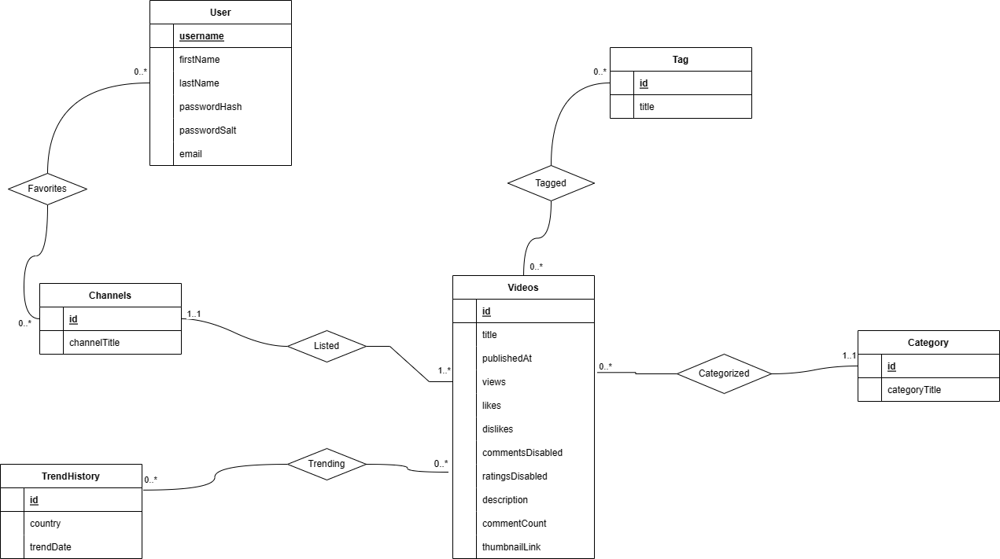
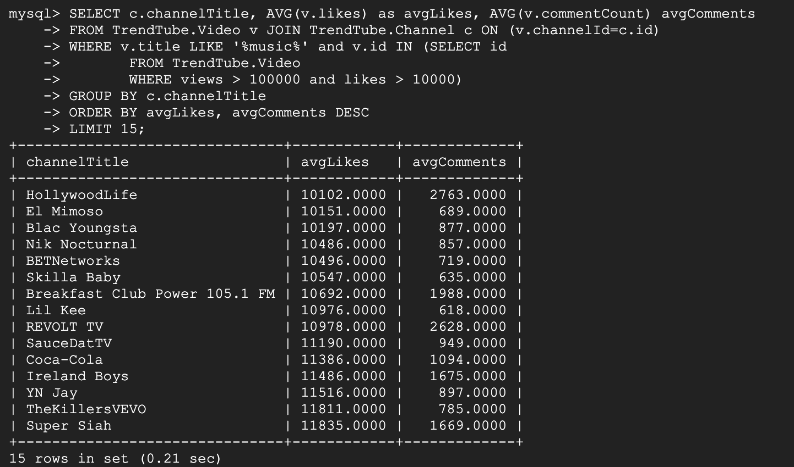
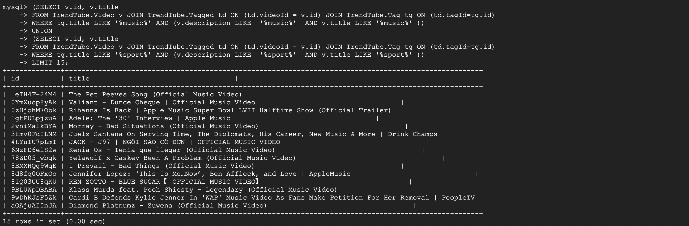

# 1. Project Summary

This project will be a web application that will allow users to interact with YouTube's Trending Videos. YouTube is a global online video sharing website that has a [Trending Page](https://www.youtube.com/feed/trending). 
According to Variety magazine, “To determine the year’s top-trending videos, YouTube uses a combination of factors including measuring users interactions (number of views, shares, comments and likes)." Channels whose videos are displayed on the Trending Page are likely to be successful channels or gain a large number of subscriptions from being showcased on the Trending Page.

However, there are some problems with the presentation, transparency, and record-keeping of YouTube's trending videos:

- Trending Videos get updated everyday, so YouTube viewers have no record to past trending videos from their favorite channels.
- YouTube doesn't highlight similarities in trending video titles, thumbnails, and comment section. This information would be useful to channels that want to have trending videos.

Hence, our application will solve these problems with the following functionality:

- YouTube viewers can login in order to have a record of their channel subscriptions in our database.
- YouTube viewers can favorite channels in order to have direct access to the channel's trending videos.
- YouTube viewers can query and view subsets of trending video data from the database.
     - Ex: specific date ranges, specific channels, specific types of videos, videos with titles that contain specific keywords, videos with likes, etc..
- YouTube viewers can access links to past trending videos in order to watch the videos.
- Owners of YouTube channels can input and update their trending videos.
- Owners of YouTube channels can filter data by metrics and then view data visualizations that highlight similarities between trending videos.

Our project will rely on the [YouTube Trending Video Dataset found on Kaggle](https://www.kaggle.com/datasets/rsrishav/youtube-trending-video-dataset?select=US_youtube_trending_data.csv). 

### Application Usefulness

Socialblade is an example of a similar website to our team’s goal.  Similar to the website that the team is trying to build, Socialblade list outs popular channels from different video platforms e.g. Twitch, TikTok and let users log in to the website to manage their favorite videos. However, SocialBlade doesn't have detailed information on trending videos, including historical trending video data.

Our application will be useful because it will allow YouTube users to query historical trending video data and input new data on trendinb dideos. This will allow users to search trending videos based on various criteria and analyze their trend. Moreover, we plan to add some visualizations features as stretch goals to help users understand their personal preferences and the factors that make Youtube videos trending.

### Application Realness

Our data is available in a public dataset on Kaggle: https://www.kaggle.com/datasets/rsrishav/youtube-trending-video-dataset?select=US_youtube_trending_data.csv. 

- The dataset contains data from August 3, 2020 - Present and is updated daily. The data contains all videos on the trending section of YouTube for multiple different regions. Each row in the dataset contains attributes describing a video that was featured in the trending section of YouTube at some point. The project uses real data collected with the YouTube API. The attributes stored in each row are video id, title, channel title, channel id, publish date/time, trending date/time, category id, tags, view count, # of likes/dislikes, # of comments, link to picture of thumbnail, tracks if like/dislike is enabled/disabled, and description.

-Data visualization is an examples of a creative component we can implement to improve the functionality of our website. With data visualizations, we can do some statistical analysis on how trending videos have changed over time. Moreover, we could use some form of machine learning to make predictions about whether or not a video will be featured on trending, or natural language processing to analyze what factors affect video popularity and lead to videos being listed in the trending section.  We can also categorize videos to see what types of videos were most frequently present in the trending section.


### Application Functionality

Basic Functions:
Query video data from the database

Simple Features:
- View data regarding the trending videos.
- Users can query subsets of the dataset and view specific data from the database in tabular form Ex: specific date ranges, specific channels, specific types of videos, videos with titles that contain specific keywords, videos with likes / dislikes > #, trending videos from specific countries/region, etc..
- Users can mark some channels as their favorites and save them into database
- Users can query video data only from the selected favorite channels.

Complex Features:
     - Users can filter data by some metric (similar to above) and then the website will create some form of graph visualization of the data.

- Interactive Data visualizations
     - Pie-Chart of trending video by genre
     - Number of trending videos for each channel in line graph
     - Histogram for common words in the title and tags of trending videos

If we have time, we will implement a machine learning feature:
     - When a new video data is given, estimate the probability of this video will go trending in Youtube.
     - When user searches a video estimate the probability that the video is liked by the user.
     
However, we will primarily focus on the data visualization aspect for the compelx features.

### Tech Stack

Our frontend tech stack will be Next.js, React, TypeScript, and Tailwind CSS. Our backend tech stack will Node.js, Express, TypeScript, and MySQL. Both the frontend and backend will be formatted with Prettier.

We will also deploy the backend to Google Cloud Platform and host the frontend on GitHub Pages.

# 2. Database Design

### UML diagram



### Assumptions of the ER/UML diagram

We decided to create our Entities based on our [YouTube Kaggle dataset](https://www.kaggle.com/datasets/rsrishav/youtube-trending-video-dataset?select=US_youtube_trending_data.csv), and remove redundant records from the dataset by representing them as entities (ex: tags, categories, and trending dates). 

A description each each entity and what data it represents:

* **User**: Contains information regarding user login information. We will uniquely identify users by their username (username is Primary Key). Hence, when users sign up on our website, they cannot use a username that already exists.
* **Channels**: Contains list channel IDs, channel names of all channels that have been featured on trending. We will uniquely identify each channel by its channel ID.
* **Videos**: Contains information about youtube videos, where each video is uniquely identified by the video ID. Videos in this table do not have to be trending. This entity contains majority of the information found in our [Kaggle dataset](https://www.kaggle.com/datasets/rsrishav/youtube-trending-video-dataset?select=US_youtube_trending_data.csv).
* **TrendHistory**: Represents a past date during which videos were trending in some country (United States, Great Britain, Japan, Canada, Korea, Russia, etc). We will uniquely identify a trend by an integer trend id.
* **Tag**: Tags are words that are associated with YouTube videos, like "prank" or "skit" or "meme." We will uniquely identify a tag by an integer tag id.
* **Category**: YouTube categories are used to [identify the type of video](https://www.tutorialspoint.com/what-are-the-different-types-of-youtube-video-categories). Each category has a type, like "Animation", "Travel", or "Comedy". We will uniquely identify a category by an integer category id.

None of these entities depend on one or more different entities to uniquely identify themselves, and hence our diagram doesn't contain any weak entity sets.

A description of each relationship and its cardinality:
* **Favorites**: Stores list of channels that a user favorites. Each user can have 0 to many favorited channels and each channel can be favorited by 0 to many users. Hence, this is a **Many to Many** relationship.
* **Listed**: Represents all of the videos listed in a channel. Each channel can have one to many videos and each video must be associated exactly 1 channel. Hence, this is a **One to Many** relationship.
* **Trending**: Marks a video as trending some time in the past. Each YouTube video can be trending in 0 or more countries in a given time frame, and for all time frames and countries, there can be 0 or more trending videos. Hence, this is a **Many to Many** relationship.
* **Tagged**: Represents tagging a video. Each tag can be used for 0 or more videos, and videos can have 0 or more tags. Hence, this is a **Many to Many** relationship.
* **Categorized**: Represents categorizing a video. Different videos can have the same category, but videos must have exactly 1 category. Moreover, there can be categories that aren't associated with any videos. Hence, this is a **One to Many** relationship.

### Relational Schema

*Entity Sets:*

```
User(username:CHAR(255) [PK], firstName:CHAR(30), lastName:CHAR(30), passwordHash:CHAR(255), passwordSalt:CHAR(255), email:CHAR(255))

Channel(id: CHAR(255) [PK], channelTitle: CHAR(30))

Tag(id :INTEGER [PK], title: CHAR(255))

Category(id: INTEGER [PK], categoryTitle: CHAR(30))

Video(id: CHAR(255) [PK], title: CHAR(255), publishedAt: CHAR(255), views: INTEGER, likes: INTEGER, dislikes: INTEGER, commentsDisabled: BIT, ratingsDisabled: BIT, description: CHAR(255), commentCount: INTEGER, thumbnailLink: CHAR(255), categoryId: INTEGER [FK to Category.id], channelId: [FK to Channel.id] )

TrendHistory(id: INTEGER [PK], country: CHAR(30), trendDate: CHAR(255)
```

*Relations:*

```
Tagged(tagId: INTEGER [PK, FK to Tag.id], videoId: CHAR(255) [PK, FK to Video.id])

Favorites(username CHAR(255) [PK, FK to User.username], channelId: CHAR(255) [PK, FK to Channel.id])

Trending(trendId: INTEGER [PK, FK to TrendHistory.id], videoId: CHAR(255) [PK, FK to Video.id])
```

### DDL commands

```sql

CREATE TABLE User(
  username CHAR(255), 
  firstName CHAR(30), 
  lastName CHAR(30), 
  passwordHash CHAR(255),
  passwordSalt CHAR(255), 
  email CHAR(255),
  PRIMARY KEY(username)
);

CREATE TABLE Channel(
  id CHAR(255),
  channelTitle CHAR(255),
  PRIMARY KEY(id)
);

CREATE TABLE Tag(
  id INTEGER, 
  title CHAR(255),
  PRIMARY KEY(id)
);

CREATE TABLE Category(
  id INTEGER, 
  categoryTitle CHAR(30),
  PRIMARY KEY(id)
);


CREATE TABLE Video(
	id CHAR(255), 
	title CHAR(255), 
	publishedAt CHAR(255), 
	views INTEGER,
	likes INTEGER, 
	dislikes INTEGER,
	commentsDisabled BIT, 
	ratingsDisabled BIT, 
	description TEXT, 
	commentCount INTEGER, 
	thumbnailLink CHAR(255), 
    channelId CHAR(255) REFERENCES Channel(id)
    ON UPDATE CASCADE
    ON DELETE CASCADE,
    categoryId INT REFERENCES Category(id)
	ON UPDATE CASCADE
    ON DELETE SET NULL,
	PRIMARY KEY (id)
);


CREATE TABLE TrendHistory(
  id INTEGER, 
  country CHAR(30), 
  trendDate DATE,
  PRIMARY KEY(id)
);

CREATE TABLE Tagged(
	tagId INTEGER REFERENCES Tag(id)
    ON DELETE CASCADE
    ON UPDATE CASCADE, 
	videoId CHAR(255) REFERENCES Video(id)
	ON DELETE CASCADE
    ON UPDATE CASCADE,
	PRIMARY KEY(tagId,videoId)
);


CREATE TABLE Favorites(
	username CHAR(255) REFERENCES User(username)
    ON UPDATE CASCADE
    ON DELETE CASCADE, 
	channelId CHAR(255)REFERENCES Channel(id)
    ON UPDATE CASCADE
    ON DELETE CASCADE,
	PRIMARY KEY(username,channelId)
);


CREATE TABLE Trending(
	trendId INTEGER REFERENCES TrendHistory(id) 
    ON UPDATE CASCADE
    ON DELETE CASCADE, 
	videoId CHAR(255) REFERENCES Video(id)
	ON UPDATE CASCADE
    ON DELETE CASCADE,
	PRIMARY KEY(trendId,videoId)
);
```


# 3. Advanced Database Features

### Advanced Queries

This query fetches the channel title and average number of likes and comments for all of its videos that have a tag containing "music", more than 100000 views, and more than 100000 likes. It uses aggregation via GROUP BY and subquery.

```sql
SELECT c.channelTitle, AVG(v.likes) as avgLikes, AVG(v.commentCount) avgComments
FROM TrendTube.Video v JOIN TrendTube.Channel c ON (v.channelId=c.id)
WHERE v.title LIKE '%music%' and v.id IN (SELECT id 
       FROM TrendTube.Video
       WHERE views > 100000 and likes > 10000)
GROUP BY c.channelTitle
ORDER BY avgLikes, avgComments DESC;
```

These are the top 15 results:



This query returns the id and title of all videos that contain "music" in at least one of their tags, description, and title unioned with all videos that contain "sport" in at least one of their tags, description, and title. It uses JOIN of multiple relations and set operations.

```sql
(SELECT v.id, v.title
FROM TrendTube.Video v JOIN TrendTube.Tagged td ON (td.videoId = v.id) JOIN TrendTube.Tag tg ON (td.tagId=tg.id)
WHERE tg.title LIKE '%music%' AND (v.description LIKE  '%music%'  AND v.title LIKE '%music%' ))
UNION
(SELECT v.id, v.title
FROM TrendTube.Video v JOIN TrendTube.Tagged td ON (td.videoId = v.id) JOIN TrendTube.Tag tg ON (td.tagId=tg.id)
WHERE tg.title LIKE '%sport%' AND (v.description LIKE  '%sport%'  AND v.title LIKE '%sport%' ));
```



### Stored Procedure

This is a stored procedure that considers all channels with a specific title, views, likes, dislikes, and comments in at least 1 video and determines their average number of likes and comments amongst their trending videos, number of trending videos, and a channel rank determined by their likes and number of trending videos.

```sql
DELIMITER //

CREATE PROCEDURE CreativeComp (title VARCHAR(255), viewCount INT, likeCount INT, dislikeCount INT, comments INT, cLimit INT)
BEGIN
    DECLARE myId VARCHAR(255);
    DECLARE myTitle VARCHAR(255);
    DECLARE myViews VARCHAR(255);
    DECLARE myLikes VARCHAR(255);

    DECLARE done int default 0;

    DECLARE channelCursor CURSOR FOR
        SELECT c.id, c.channelTitle, AVG(v.views) as avgViews, AVG(v.likes) as avgLikes
            FROM TrendTube.Video v JOIN TrendTube.Channel c ON (v.channelId=c.id)
            WHERE v.title LIKE title and v.id IN (SELECT id
                                                    FROM TrendTube.Video
                                                    WHERE views > viewCount and likes > likeCount AND dislikes < dislikeCount AND commentCount > comments)
            GROUP BY c.id
            ORDER BY avgViews DESC, avgLikes DESC
            LIMIT cLimit;

    DECLARE CONTINUE HANDLER FOR NOT FOUND SET done = 1;

    DROP TABLE IF EXISTS FinalTable;

    CREATE TABLE FinalTable (
        ChannelId VARCHAR (255),
        ChannelTitle VARCHAR (255),
        AvgLikes DOUBLE,
        AvgComments INT,
        Category VARCHAR(255),
        NumTrending INT,
        ChannelRank INT
    );

    OPEN channelCursor;

    REPEAT
        FETCH channelCursor INTO myId, myTitle, myViews, myLikes;
        
        IF NOT done THEN
			SET @category = (SELECT categoryTitle FROM (SELECT categoryTitle, COUNT(categoryTitle) as categoryCount FROM TrendTube.Video v JOIN TrendTube.Channel c ON (v.channelId=c.id) JOIN TrendTube.Category c2 ON (categoryId=c2.id)
				WHERE c.id=myId
				GROUP BY categoryTitle
				ORDER BY categoryCount DESC
				LIMIT 1) newTable);
			
			SET @avgLikes = (SELECT ROUND(AVG(v.likes))
				FROM TrendTube.Video v JOIN TrendTube.Channel c ON (v.channelId=c.id) WHERE c.id=myId);

			SET @avgComments = (SELECT ROUND(AVG(v.commentCount))
				FROM TrendTube.Video v JOIN TrendTube.Channel c ON (v.channelId=c.id) WHERE c.id=myId);

			SET @numTrending = (SELECT COUNT(v.id)
				FROM TrendTube.Video v JOIN TrendTube.Channel c ON (v.channelId=c.id) WHERE c.id=myId);

			SET @channelRank = 5;

			IF @avgLikes >= 100000
			THEN
				SET @channelRank = 5;
			END IF;

			IF @avgLikes >= 250000
			THEN
				SET @channelRank = 4;
			END IF;

			IF @avgLikes >= 500000
			THEN
				SET @channelRank = 3;
			END IF;

			IF @avgLikes >= 1000000 AND @numTrending >= 2
			THEN
				SET @channelRank = 2;
			END IF;

			IF @avgLikes >= 1000000 AND @numTrending >= 10
			THEN
				SET @channelRank = 1;
			END IF;

			INSERT INTO FinalTable
				VALUES (myId, myTitle, @avgLikes, @avgComments, @category, @numTrending, @channelRank);
		END IF;
    UNTIL done
    END REPEAT;

    CLOSE channelCursor;

    SELECT * FROM FinalTable ORDER BY ChannelRank, AvgLikes DESC, AvgComments DESC;
END //

DELIMITER ;
```

### Trigger

This trigger creates a new Channel record with a default name if a Video was inserted without an associated Channel.

```sql
DELIMITER //
CREATE TRIGGER ChannelTrig
    AFTER INSERT ON Video
    FOR EACH ROW
    BEGIN
        IF NOT EXISTS(SELECT channelTitle FROM Channel c WHERE c.id=new.channelId)
        THEN
            INSERT INTO Channel(id, channelTitle) VALUES (new.channelId, CONCAT("Default YouTube Channel - ", new.title));
        END IF;
    END
//
DELIMITER ;
```

To list triggers and stored procedure, use:

```sql

Use TrendTube;
Show Triggers;

SELECT 
  ROUTINE_SCHEMA,
  ROUTINE_NAME
FROM INFORMATION_SCHEMA.ROUTINES
WHERE ROUTINE_TYPE = 'PROCEDURE';
```
